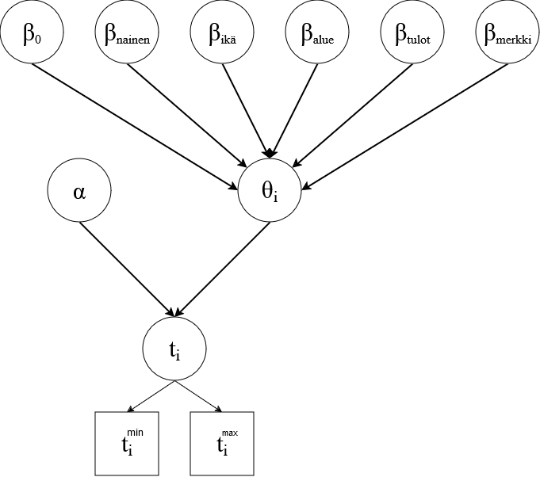

```{r setup, include=FALSE}
library(ggplot2)
library(bookdown)
library(patchwork)
library(scales)
library(rlang)
library(haven)
library(tidyr)
library(dplyr)
library(knitr)
library(xtable)
library(bayesplot)
library(rstan)
```
# Aineisto

Harjoitustyössä tehtävänä on arvioida eri tekijöiden vaikutusta matkapuhelimen käyttöikään. Aineistona käytetään matkapuhelimen hankintaa käsittelevää kyselytutkimusta [@Karvanen_2014]. Kiinnostuksen kohteena olevat tekijät aineistossa ovat sukupuoli, ikä, maantieteellinen alue, entisen matkapuhelimen merkki ja kotitalouden tulot. Kaikki selittäjät ovat nyt kategorisia. Kyselyssä vastaajat ovat esimerkiksi ilmoittaneet vain ikäryhmänsä eivätkä tarkkaa ikäänsä. Kategorisoidaan entisen matkapuhelimen merkit siten, että kategoriat ovat Nokia, iPhone, Samsung ja muut merkit.

Entisen puhelimen käyttöikä saadaan aineistosta välisensuroituna, sillä vastaajat ovat ilmoittaneet matkapuhelinten hankinta-ajat tarkimmillaan kuukauden tarkkuudella. Esimerkiksi jos vastaaja olisi ilmoittanut, että hän on hankkinut entisen puhelimensa toukokuussa 2008 ja nykyisen puhelimen heinäkuussa 2009 niin olisi entisen puhelimen käyttöikä pienimmillään 13 kuukautta ja suurimmillaan 15 kuukautta. Aineistossa on tapauksia, joissa vastaaja ei muista juuri mitään nykyisen tai entisen puhelimen hankinnasta. Tällaisissa tapauksissa minimikäyttöiästä tulee hyvin pieni ja maksimikäyttöiästä hyvin suuri. Maksimikäyttöiälle on asetettu ylärajaksi 200 kuukautta. Kuvassa \@ref(fig:Aika) nähdään minimi- ja maksimikäyttöikien tiheysfunktioiden kuvaajat.

\newpage

```{r, echo=FALSE, inclue=FALSE}
library("dplyr")
library("ggplot2")
library("tidyr")

set.seed(123)

url <- "http://users.jyu.fi/~santikka/bayes2/data/mobile_phone_purchases.csv"
mobile <- read.csv2(url, header = TRUE)

monthdiff <- function(year1, month1, year2, month2) {
12 * (year2 - year1) + (month2 - month1)
}
# Q43 When did you purchase your current phone? Year of purchase (9999 = missing)
# Q44 When did you purchase your current phone? Month of purchase (13 = missing)
# Q45 When did you purchase your current phone? Season of purchase
# (1 = winter, 2 = spring, 3 = summer, 4 = autumn, 5 = missing)
#sukupuoli, ikä, maantieteellinen alue, matkapuhelimen merkki
mobile <- mobile |>
rename(
year_cur = Q43,
month_cur = Q44,
season_cur = Q45,
year_prev = Q48,
month_prev = Q49,
season_prev = Q50,
brand_prev = Q47,
sex = Sukup,
age = Ika,
region = Alue,
income = Tulot
) |>
mutate(
  sex = factor(sex),# labels=c("Mies", "Nainen")),
  age = factor(age),# labels=c("15-24", "25-34", "35-44", "45-54", "55-64", "65-79")),
  region = factor(region),# labels=c("Helsinki-Uusimaa", "Etelä-Suomi", "Länsi-Suomi", "Itä- ja Pohjois-Suomi")),
  income = factor(income),# labels=c("max 30 000 €", "30 001–50 000 €", "50 001–70 000 €", "min 70 000 €", "Eos")),
  brand_prev = ifelse(brand_prev %in% c(4,5,6,7), 4, brand_prev), #Jaotellaan Nokia, iPhone, Samsung, Muut
  brand_prev = factor(brand_prev),# labels=c("Nokia", "Apple iPhone", "Samsung", "Muu")),
  
# 9999 denotes NA for year in the data,
  year_cur = na_if(year_cur, 9999),
  year_prev = na_if(year_prev, 9999),

# month_min and max are helper variables used to determine the
# first or last possible month based on the season if month is NA
month_min_cur = month_cur - 1,
month_max_cur = month_cur,
month_min_prev = month_prev - 1,
month_max_prev = month_prev,

# 13 indicates NA for month, 5 indicates NA for season
month_min_cur = case_when(
month_cur == 13 & season_cur == 1 ~ 0,
month_cur == 13 & season_cur == 2 ~ 3,
month_cur == 13 & season_cur == 3 ~ 6,
month_cur == 13 & season_cur == 4 ~ 9,
month_cur == 13 & season_cur == 5 ~ 0,
.default = month_min_cur
),
month_max_cur = case_when(
month_cur == 13 & season_cur == 1 ~ 3,
month_cur == 13 & season_cur == 2 ~ 6,
month_cur == 13 & season_cur == 3 ~ 9,
month_cur == 13 & season_cur == 4 ~ 12,
month_cur == 13 & season_cur == 5 ~ 12,
.default = month_max_cur
),
month_min_prev = case_when(
month_prev == 13 & season_prev == 1 ~ 0,
month_prev == 13 & season_prev == 2 ~ 3,
month_prev == 13 & season_prev == 3 ~ 6,
month_prev == 13 & season_prev == 4 ~ 9,
month_prev == 13 & season_prev == 5 ~ 0,
.default = month_min_prev
),
month_max_prev = case_when(
month_prev == 13 & season_prev == 1 ~ 3,
month_prev == 13 & season_prev == 2 ~ 6,
month_prev == 13 & season_prev == 3 ~ 9,
month_prev == 13 & season_prev == 4 ~ 12,
month_prev == 13 & season_prev == 5 ~ 12,
.default = month_max_prev
),

#Min and max months between previous and current phone
ict_min = monthdiff(year_prev, month_max_prev, year_cur, month_min_cur),
ict_max = monthdiff(year_prev, month_min_prev, year_cur, month_max_cur),

# Enforce sanity of responses (max must be larger than min)
ict_min = case_when(
ict_min <= 0 | is.na(ict_min) ~ 0.1, # There must be a slight difference
.default = ict_min
),
ict_max = case_when(
ict_max <= 0 | is.na(ict_max) ~ 200, # The absolute maximum time (decided),
.default = ict_max
),

# Transformation into years
ict_min = ict_min / 12,
ict_max = ict_max / 12,
ict_mean = (ict_max + ict_min)/2
)

# Empirical density functions
d2 <- mobile |>
select(ict_min, ict_max) |>
pivot_longer(cols = everything(),
names_pattern = "ict_(.+)",
names_to = "kuvaaja",
values_to = "ict"
)
```

```{r Aika, echo=FALSE, fig.cap="Minimi- ja maksimikäyttöiän tiheydet", fig.height=3}
ggplot(d2, aes(x = ict, y = after_stat(density), colour = kuvaaja)) +
geom_density() +
xlab("Puhelimen käyttöikä") +
ylab("Tiheys")+
theme_bw()
```

# Mallinnus

Mallinnetaan selittäjien yhteyttä puhelimen käyttöikään seuraavasti:

\begin{equation}
  \begin{split}
    &t_i \in [t_i^{min},t_i^{max}],\\
    &t_i \sim Gamma(\alpha, \theta_i),\\
    &\alpha \sim invGamma(1,1),\\
    &\log(\theta_i) = \beta_0 + \beta_{nainen} + \beta_{ikä} + \beta_{tulot} + \beta_{alue} + \beta_{merkki},\\
    &\beta \sim N(0,10)\\
  \end{split}
\end{equation}

Käyttöiät $t_i$ oletetaan siis gammajakautuneiksi yhteisellä muotoparametrilla $\alpha$ ja jokaiselle käyttöiälle omalla skaalaparametrilla $\theta_i$. Muotoparametrin prioriksi asetetaan heikosti informatiiviinen käänteinen gammajakauma. Skaalaparametrien logaritmien oletetaan riippuvan lineaarisesti selittäjistä. Referenssitaso on nyt Uudellamaalla asuva 15-24-vuotias mies, jonka tulot ovat enintään 30000 € ja jonka edellinen puhelin oli Nokia.
Parametrit $\beta$ kuvaavat selittäjien vaikutusta puhelimen käyttöikään. Nyt esimerkiksi ikäryhmiä on kuusi joten siihen liittyviä regressiokertoimia on 5. Yhteensä $\beta$-kertoimia mallissa on 17 ja tarkemmin ne on kuvattu taulukossa 1. Jokaiselle parametrille $\beta$ asetetaan heikosti informatiivinen priori $N(0,10)$. Mallin hierarkkinen rakenne on kuvattu kuvassa \@ref(fig:DAG). 

| Parametri               | Selitys                   |
|:-----------------------:|:-------------------------:|
| $\beta_{0}$             | Vakiotermi                |
| $\beta_{nainen}$        | Sukupuoli                 |
| $\beta_{ikä}[5]$        | Ikäryhmä                  |
| $\beta_{tulot}[4]$      | Tuloluokka                |
| $\beta_{alue}[3]$       | Maantieteellinen asuinalue|
| $\beta_{merkki}[3]$     | Puhelimen merkki          |
Table: Selittäjiä vastaavat kertoimet

```{r DAG, echo=FALSE, fig.cap="Mallin DAG-kuvaaja", out.width='70%', out.height='70%', dev='svg', fig.align='center'}

```

```{r, echo=FALSE, include=FALSE}
scode <- "
data{
  int<lower=0> n;
  real<lower=0> t_max[n];
  real<lower=0> t_min[n];
  int<lower=0, upper=5> age[n];
  int<lower=0, upper=1> sex[n];
  int<lower=0, upper=3> region[n];
  int<lower=0, upper=3> brand[n];
  int<lower=0, upper=4> income[n];
}
parameters{
  real<lower=0, upper=1> t_init[n];
  
  real<lower=0> alpha;
  
  real beta_0;
  real beta_age[5];
  real beta_sex;
  real beta_region[3];
  real beta_brand[3];
  real beta_income[4];
}
transformed parameters{
  //skaalataan t minimien ja maksimien väliin
  real<lower=0> t[n];
  
  real logtheta[n];
  for (i in 1:n){
    t[i] = t_min[i] + t_init[i]*(t_max[i] - t_min[i]);
    
    logtheta[i] = beta_0;
    
    if (age[i] != 0) logtheta[i] += beta_age[age[i]];
    if (sex[i] != 0) logtheta[i] += beta_sex;
    if (region[i] != 0) logtheta[i] += beta_region[region[i]];
    if (brand[i] != 0) logtheta[i] += beta_brand[brand[i]];
    if (income[i] != 0) logtheta[i] += beta_income[income[i]];
  }
  
}
model{
  alpha ~ inv_gamma(1,1);
  
  beta_0 ~ normal(0, 10);
  beta_age ~ normal(0, 10);
  beta_sex ~ normal(0, 10);
  beta_region ~ normal(0, 10);
  beta_brand ~ normal(0, 10);
  beta_income ~ normal(0, 10);
  
  t ~ gamma(alpha, exp(-logtheta));
}
"

fit <- stan(
  model_code = scode,
  data = list(
    n = nrow(mobile),
    t_max = mobile$ict_max,
    t_min = mobile$ict_min,
    age = as.integer(mobile$age)-1,
    sex = as.integer(mobile$sex)-1,
    income = as.integer(mobile$income)-1,
    region = as.integer(mobile$region)-1,
    brand = as.integer(mobile$brand_prev)-1
  ),
  iter = 2000,
  chains = 1,
  pars = c("logtheta", "t_init"),
  include = FALSE,
  cores=4,
  refresh=0
)

params <- rstan::extract(fit, pars = c("t"), include=FALSE)

t_ennuste <- rstan::extract(fit, pars = c("t"))

mean(t_ennuste$t)
```

# Tulokset

```{r, include=FALSE, echo=FALSE}
s <- summary(fit, pars = c("alpha", "beta_0", "beta_age", "beta_sex",
                 "beta_region", "beta_brand", "beta_income"), probs=c(0.025, 0.975))$summary

labels <- c("$\\alpha$", "$\\beta_0$", "$\\beta_{25-34}$", "$\\beta_{35-44}$",
            "$\\beta_{45-54}$", "$\\beta_{55-64}$", "$\\beta_{65-79}$",
            "$\\beta_{nainen}$", "$\\beta_{etelä}$", "$\\beta_{länsi}$", 
            "$\\beta_{\\text{itä ja pohjoinen}}$", "$\\beta_{iPhone}$", "$\\beta_{Samsung}$",
            "$\\beta_{\\text{Muu merkki}}$", "$\\beta_{30k-50k}$", 
            "$\\beta_{50k-70k}$", "$\\beta_{min 70k}$", "$\\beta_{\\text{tulot EOS}}$")

means <- rep(0, 18)

means[1] <- mean(params$alpha)
means[2] <- mean(params$beta_0)
means[3:7] <- apply(params$beta_age, 2, mean)
means[8] <- mean(params$beta_sex)
means[9:11] <- apply(params$beta_region, 2, mean)
means[12:14] <- apply(params$beta_brand, 2, mean)
means[15:18] <- apply(params$beta_income, 2, mean)

means <- round(means, digits = 3)

deviations <- rep(0, 18)

deviations[1] <- sd(params$alpha)
deviations[2] <- sd(params$beta_0)
deviations[3:7] <- apply(params$beta_age, 2, sd)
deviations[8] <- sd(params$beta_sex)
deviations[9:11] <- apply(params$beta_region, 2, sd)
deviations[12:14] <- apply(params$beta_brand, 2, sd)
deviations[15:18] <- apply(params$beta_income, 2, sd)

deviations <- round(deviations, digits=3)

intervals <- cbind(rep(0, 18), rep(0, 18))

intervals[1,] <- quantile(params$alpha, probs = c(0.025, 0.975))
intervals[2,] <- quantile(params$beta_0, probs = c(0.025, 0.975))
intervals[3:7,] <- t(apply(params$beta_age, 2, quantile, probs = c(0.025, 0.975)))
intervals[8,] <- quantile(params$beta_sex, probs = c(0.025, 0.975))
intervals[9:11,] <- t(apply(params$beta_region, 2, quantile, probs = c(0.025, 0.975)))
intervals[12:14,] <- t(apply(params$beta_brand, 2, quantile, probs = c(0.025, 0.975)))
intervals[15:18,] <- t(apply(params$beta_income, 2, quantile, probs = c(0.025, 0.975)))

intervals <- round(intervals, digits=3)

param_df <- data.frame(param = labels, means = means, deviations = deviations, q2.5 = intervals[,1], q97.5 = intervals[,2])
```
```{r echo=FALSE, include=FALSE}
#Keskimääräinen käyttöikä
mean(t_ennuste$t)

#Käyttöiän keskihajonta
sd(t_ennuste$t)
```


Mallinnus toteutettiin Stanilla. Tulokset ovat näkyvillä taulukossa \@ref(tab:Malli). Jokaisen vastaajan puhelimen käyttöiälle saadaan nyt 8000 posteriorinäytettä ja näiden avulla voidaan estimoida koko aineiston keskimääräistä puhelimen käyttöikää joka olisi nyt siis noin 3,8 vuotta. Käyttöiän keskihajonta olisi taas noin 2,7 vuotta. Keskihajonta on melko suuri, mikä on luonnollista sillä käyttöikään liittyy nyt paljon epävarmuutta.

\newpage

```{r Malli, echo=FALSE, tab.cap="Mallinnuksen tulokset"}
kable(param_df, escape = FALSE, col.names = c("Parametri", "Posteriorikeskiarvo", "Keskihajonta", "2,5 \\%", "97,5 \\%"))
```

# Tulkinnat

```{r, echo=FALSE, include=FALSE}
mean(params$alpha*exp(params$beta_0))

mean(exp(params$beta_age[,4]))
```

Selittäjien vaikutusta puhelimen käyttöikään on nyt hieman vaikeampaa tulkita, kuin esimerkiksi tavallisen lineaarisen regression tapauksessa. Gamma-jakautuneen käyttöiän odotusarvo on $E(t_i) = \alpha\theta_i$. Referenssivastaajan puhelimen käyttöiän posteriorikeskiarvo olisi siis nyt $\alpha e^{\beta_0} \approx 3{,}09$ eli noin kolme vuotta. Tarkastellaan nyt myös kerrointa $\beta_{55-64}$, jonka posteriorikeskiarvo on noin $0{,}537$ ja jonka $95 \%$-posterioriväli sisältää vain selvästi positiivisia arvoja. Parametrin $\theta_i$ arvo on siis $e^{\beta_{55-64}} \approx 1{,}73$-kertaa suurempi 55-64-vuotiailla kuin muuten vastaavanlaisilla 15-24 vuotiailla (referenssitaso). Täten myös käyttöiän odotusarvo on vastaavan kertoimen verran suurempi.

Yleisesti voidaan todeta, että jos parametrin $95 \%$-posterioriväli sisältää nollan, ei vastaavalla ominaisuudella ole merkittävää vaikutusta puhelimen käyttöikään. Nyt näyttäisi siltä, että puhelimen käyttöikä on pidempi 45-79 vuotiailla. Sukupuolella, asuinalueella tai tuloluokalla ei näytä olevan selkeää vaikutusta käyttöikään. iPhonen käyttäjillä puhelimen käyttöikä vaikuttaisi olevan pienempi kuin muilla.

Kuvassa \@ref(fig:Ennusteet) on visualisoitu muutaman käyttöiän posteriorijakaumat. Todellisia puhelimien käyttöikiä ei ole saatavilla, joten keinot mallin sopivuuden tarkasteluun ovat varsin rajalliset. Posterioriennusteita kyselyyn vastaajien puhelimen käyttöiälle voidaan verrata tunnettuihin ala- ja ylärajoihin esimerkiksi kertymäfunktioiden avulla \@ref(fig:Posteriori). Posteriorinäytteiden kuvaajat kulkevat minimi- ja maksimikuvaajien välissä, joten mallinnus mallinnus on siltä osin kunnossa.

```{r, echo=FALSE, include=FALSE}
n_plot <- 25

it <- seq(0, 20, by = 0.05)

ecdf_values <- matrix(0, ncol = n_plot, nrow = length(it))

sample_index <- sample(1:nrow(mobile), n_plot, replace = FALSE)

for (i in 1:n_plot) {
  ecdf_values[,i] <- ecdf(t_ennuste$t[sample_index[i],])(it)
}

time = gl(2, length(it), labels = c("max", "min"))

d1 <- data.frame(
  it = rep(it, n_plot),
  ecdf = as.vector(ecdf_values),
  sample_id = gl(n_plot, length(it)),
  kuvaaja = rep("posterioriennusteita", n_plot)
)

d2 <- data.frame(
  it = c(it, it),
  ecdf = c(ecdf(mobile$ict_max)(it), ecdf(mobile$ict_min)(it)),
  kuvaaja = gl(2, length(it), labels = c("käyttöiän yläraja", "käyttöiän alaraja"))
)
```

```{r Posteriori, echo=FALSE, fig.cap="Posteriorinäytteiden kertymäfunktioita verrattuna aineistoon", fig.height=3}
ggplot(d2, aes(x = it, y=)) +
geom_line(data=d1, aes(x=it, y=ecdf, group = sample_id, colour = kuvaaja), alpha=0.7) +
geom_line(aes(y=ecdf, colour = kuvaaja), linewidth=0.8) +
xlab("Puhelimen käyttöikä") +
ylab("Kertymä") +
theme_bw()
```

```{r Ennusteet, echo=FALSE, fig.cap="Kuuden eri käyttöiän posteriorijakaumat"}
plot(fit, plotfun="hist", pars=c("t[1]", "t[2]", "t[3]", "t[4]", "t[5]", "t[6]"), bins=20)
```

# Lähdeviitteet
